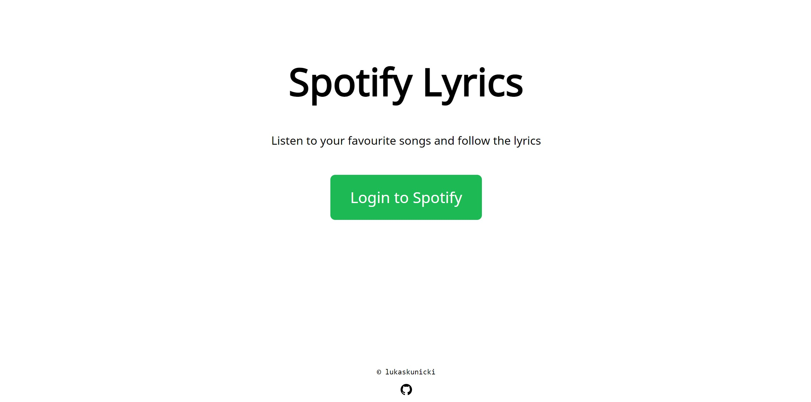
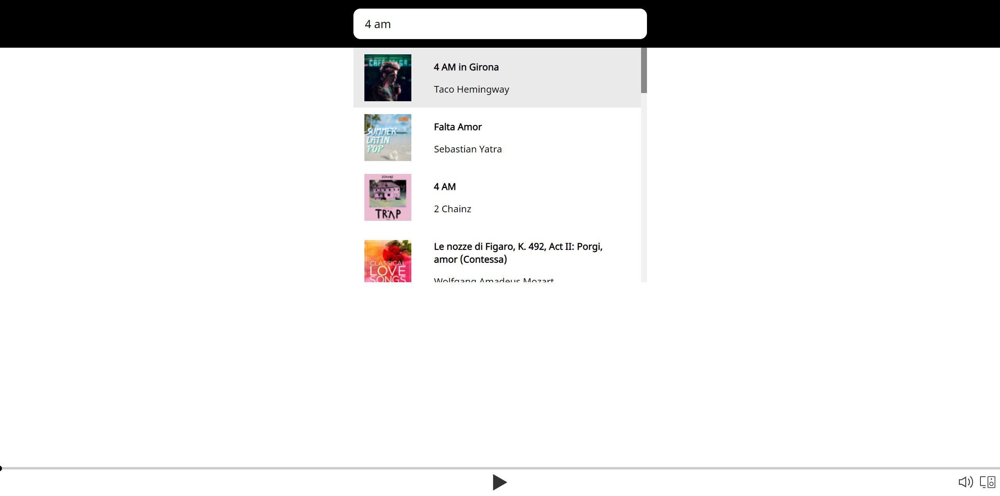
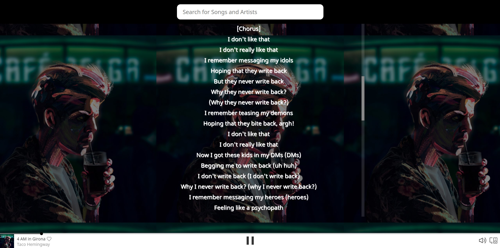
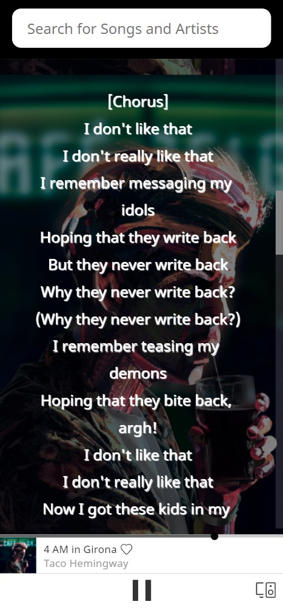

# Spotify Lyrics

Spotify Lyrics app has been created using **Node JS** on for the Server side and **React JS** on the frontend.

#### <u>Live demo</u>

https://spotify-lyrics-web-app.herokuapp.com/



Please log in with your Spotify account.<br>
**Remember that the Web Player API works for premium accounts only.**



Search for your favourite songs.



The lyrics will be pulled automatically and appear in a scrollable box.



The app has been prepared with a view to mobile devices as well.


#### <u>Local development</u>

1. Setup your developer accounts for `Spotify` and `Genius`
2. Prepare your .env file with the following values
```
REDIRECT_URI=http://localhost:5000
SPOTIFY_CLIENT_ID=XXXXXXXXXXXXXXXXXXXXXXXXXXXXX
SPOTIFY_CLIENT_SECRET=XXXXXXXXXXXXXXXXXXXXXXXXXXXXX
GENIUS_CLIENT_ID=XXXXXXXXXXXXXXXXXXXXXXXXXXXXX
GENIUS_CLIENT_SECRET=XXXXXXXXXXXXXXXXXXXXXXXXXXXXX
```
3. Edit the `config.js` for the frontend application

```javascript
const config = {
  API_URL: "http://localhost:5000/",
  CLIENT_ID: "SPOTIFY_CLIENT_ID",
  REDIRECT_URI: "http://localhost:5000",
};
export default config;
```
4. To build the frontend app simply run `npm run build` in the `frontend` directory
5. Move `/build` to the root directory 
6. Run server with `node server.js`